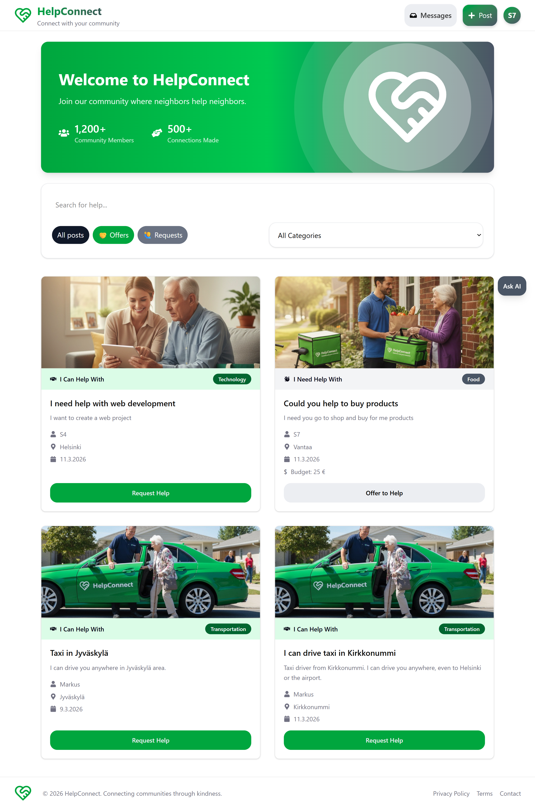

# HelpConnect

HelpConnect is a community‑driven platform designed to connect people who need assistance with those who are willing and able to help. It creates a simple, accessible way for community members to request support or offer their time, skills, and resources.



---

## 🌍 Purpose

Communities often include people who could use help — elderly individuals, injured residents, busy parents, or anyone seeking convenience. At the same time, many volunteers, organizations or ordinary people want to contribute but lack a centralized place to do so.

HelpConnect bridges this gap by providing a platform where:

- Users can **post requests** for help  
- Volunteers, ordinary people and organizations can **offer assistance**  
- Everyone can **communicate and coordinate** easily  

---

## 👥 Who Can Use HelpConnect?

### People who may need assistance
- Elderly individuals  
- Injured or temporarily limited users  
- Busy parents  
- Anyone looking for convenience or support  

### People who can offer help
- People with time or skills  
- Local organizations  
- Community groups  

HelpConnect is designed to be inclusive — anyone can join, request help, or offer it.

---

## 🚀 Features

### 📝 Post Requests & Offers
Users can create posts describing what they need or what they can provide. Posts are categorized for easy browsing.

### 🔍 Browse & Filter
A searchable and filterable feed helps users quickly find relevant posts.

### 💬 Real‑Time Chat
Users can communicate instantly to coordinate details.

### 🤖 AI Chat Assistant
An integrated AI assistant helps users navigate the platform and get quick answers.

### 👤 User Profiles
Each user has a profile with personal details, posts, and activity.

### 🛠️ Admin Dashboard
Admins can manage:
- Users  
- Posts  
- Platform content  

### 🌐 Full‑Stack Architecture
HelpConnect includes:
- A backend API  
- A frontend interface  
- Database integration  
- Real‑time communication features  

---

## 📁 Project Structure

- /backend   → Node.js + MongoDB API
- /frontend  → React-based user interface

---

## 📚 API Documentation

For detailed API documentation, see the backend README:  
[Backend API Documentation](./backend/README.md)

---

## 🔗 Useful Links

- **Prototype (Figma):**  
  https://www.figma.com/make/qMKm053W5kn1JNJOwQ51h0/Help-App?t=hXBCaRWimu2RI1rC-1

- **Live Deployment:**  
  https://web-project-k172.onrender.com/

- **Repository:**  
  https://github.com/makuzaza/web_project_helpconnect

---

## 🏁 Getting Started

### Requirements
- Node.js
- MongoDB

---

## Installation

```bash
# Clone the repository
git clone https://github.com/makuzaza/web_project_helpconnect

# backend install
cd web-project/backend
npm install

# frontend install
cd ../frontend
npm install

# configure environment
cd ../backend
cp .env.example .env
# update .env values
```

### Run backend and frontend in separate terminals
```bash
# navigate to backend folder
cd web-project/backend
# run
npm run dev
```
```bash
# navigate to frontend folder
cd web-project/frontend
# run
npm run dev
```

## Team & Roles :

### Backend Developers:

- **Name:** Maria Kuznetsova
- **GitHub:** _[https://github.com/makuzaza]_
- **Name:** Mikael Nyman
- **GitHub:** _[https://github.com/MiksuNy]_

### Frontend Developers

- **Name:** Markus Kannisto
- **GitHub:** _[https://github.com/Marakusa]_
- **Name:** Minoo Yaghoubi
- **GitHub:** _[https://github.com/Minoo-YH]_
